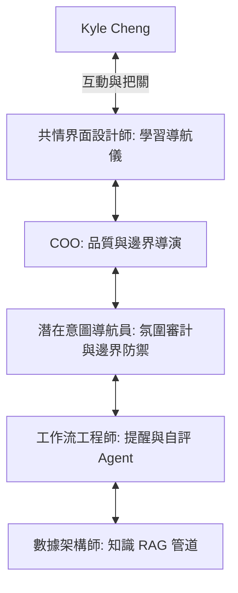

# 共情工程服務方案 (Empathetic Engineering Service Design) - v1
**專案名稱：Kyle Cheng 專屬知識與學習陪伴路徑 (Project: Personalized Knowledge & Learning Companionship)**
**客戶姓名：** Kyle Cheng
**承接單位：** AugmentAlign (智協科技顧問) COO 團隊

---

## 1. 意圖對齊：理解大於執行，陪伴重於工具 (Intent Alignment)

Kyle，我們深知您面對的挑戰不是「缺少整理資料的工具」，而是**如何在浩瀚的資訊中尋求條理，並保持穩定的前進步伐**。

在 Software 3.0 與 AGI 時代，市面上充斥著各式各樣的「一鍵生成」、「AI 代寫」工具。然而，這些工具往往蒸發了人類的思考，奪走了屬於您個人的「理解」與「品味」。
我們的核心信念是：**「你可以外包思考，但不能外包理解。」** 

本方案的定位是您的**「智慧盟友與思考夥伴」**。我們不會代替您寫專題報告，也不會替您做決定；我們的任務是透過高度客製化的 Agent 矩陣，為您搭建整理資料的基礎設施，並在陪伴中為您提供見解與穩定的推進力。

---

## 2. 服務核心支柱：陪伴與見解的具體實踐

根據您的需求，我們設計了以下三項核心服務：

*   **每日進度推進提醒 (Daily Progress Push)**：
    *   *他人的做法*：冷冰冰的定時鬧鐘或待辦清單通知。
    *   *我們的做法*：共情進度推手。根據您的學習路徑與當日整理進度，發送具備溫度、脈絡化的前進提醒，引導您回顧當天最核心的收穫，而非單純的催促。
*   **每週自評報告生成 (Weekly Self-Assessment)**：
    *   *他人的做法*：自動生成圖表與枯燥的字數/時間統計。
    *   *我們的做法*：見解自省報告。彙整您一週以來的資料整理軌跡，提煉出您思維中的亮點與盲區，以問答和啟發性見解的形式呈現，協助您在每週結束時整理心智狀態。
*   **專屬學習路徑設計 (Custom Learning Path)**：
    *   *他人的做法*：靜態的課程大綱或千篇一律的學習進度表。
    *   *我們的做法*：動態知識地圖。根據您整理資料的深度與回饋，動態規劃並調整最適合您的資料分類與主題探索路徑。

---

## 3. 共情矩陣架構： specialists 職責分配 (Specialist Architecture)

我們將動員公司內部的 Specialist 團隊，為您配置專屬的多代理人矩陣：

### A. 數據與代理架構師 (Data & Agentic Architect)
*   **任務**：為您建構「專屬資料 RAG 記憶層」。
*   **設計**：不只是將資料丟進向量資料庫，而是建立具備「高度代理可讀性 (Legible)」的分類標籤與概念索引。透過關聯性分析，讓 Agent 能夠秒懂您整理的資料脈絡，以便在自評報告中給出深刻的見解。

### B. 多代理工作流工程師 (Workflow Engineer)
*   **任務**：建構推進提醒與報告生成的自主工作流。
*   **設計**：
    *   **進度感知 Agent**：監測您的資料整理活動，並確保每日提醒能準時、無干擾地推送。
    *   **自評提煉 Agent**：建構自主除錯迴圈，防止自評報告生成過程中出現幻覺（Hallucination），確保見解的真實性與啟發性。

### C. 共情界面設計師 (Empathy Interface Designer)
*   **任務**：設計降低資訊焦慮的「學習導航儀」。
*   **設計**：避開複雜的管理儀表板，為您提供一個極簡、沉靜的視覺化學習路徑地圖。界面只呈現兩件事：「您今天在哪裡」與「您下一步可以往哪走」，給予您最純粹的陪伴感。

### D. 潛在意圖導航員 (Latent Intent Director) — *核心防禦機制*
*   **任務**：**嚴格執行「不代筆、不做決定」的邊界防禦。**
*   **設計**：這是我們原生型的關鍵保障。它會即時審查 Agent 輸出的所有每日提醒與自評報告，進行「意圖漂移審計」。一旦發現 Agent 的語氣過於強勢（如替您下結論）或內容涉嫌代寫報告，導航員將立即攔截並重塑內容，確保您始終在導演的位置上，掌握絕對的自主權。

---

## 4. 服務方案的邊界與防禦 (Service Boundaries)

我們嚴格遵守以下「非取代性」憲章，這是我們對您個人成長的尊重：

| 服務項目 | 我們做什麼 (見解與陪伴) | 我們絕對不做 (外包理解) |
| :--- | :--- | :--- |
| **資料整理** | 協助您對資料進行語義標籤、關聯推薦與結構化檢索。 | 代替您閱讀原始資料或省略您自己的吸收過程。 |
| **專題報告** | 提供結構建議、邏輯漏洞分析與思維啟發見解。 | **代替您撰寫任何一段報告正文或代筆草稿。** |
| **學習與研究決策**| 提供多角度的利弊分析與學習路徑選項。 | **替您做出要使用哪份資料或得出何種結論的決定。** |

---

## 5. 品質閘口 (Quality Gates)

我們用以下標準來衡量我們服務的品質與溫度：

1.  **邊界防禦率 (Boundary Enforce Rate)**：`100%`。所有 Agent 的輸出內容，代寫或代決策的判定必須為 `0`。
2.  **見解精準度 (Recall@5 & Vibe Audit)**：自評報告中的見解關聯性評分需大於 `90%`，且必須給予陪伴感而非審判感。
3.  **提醒響應率 (Workflow Punctuality)**：每日推送進度提醒的準時率需達到 `100%`，且能感應客戶忙碌狀態進行彈性微調。

---
*生成於：AugmentAlign COO 專案工作流 v2.1*
*「別家賣的是工具，我們給的是陪伴；別家給的是答案，我們給的是見解。」*
